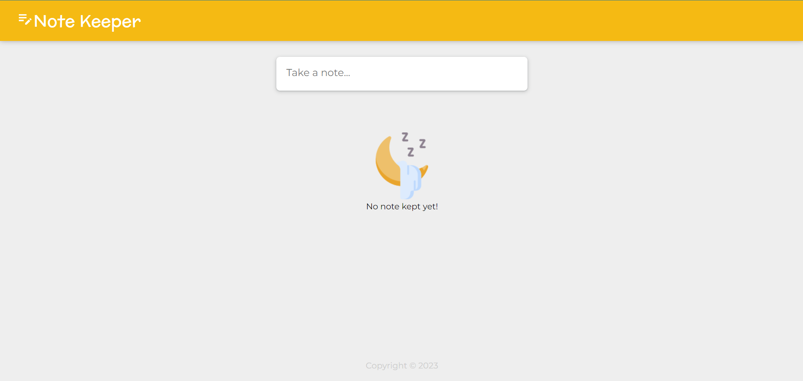
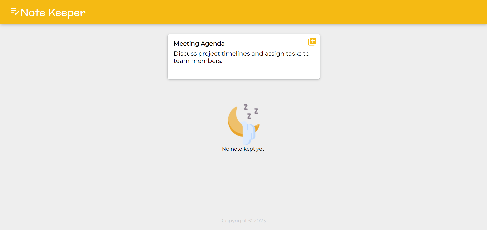
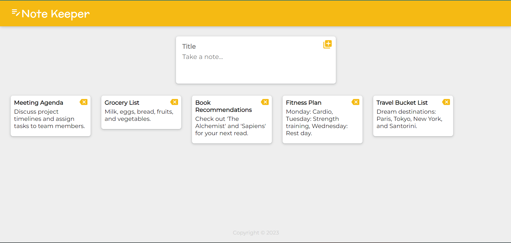

# Note Keeper App

Note Keeper application developed using React. This app is used to take notes. Inspired from Sticky notes.

## Steps

1. Clone the repository

```
https://github.com/EziOPratikk/Note-Keeper.git
```

2. Get node_modules

```
npm install
```

3. Run the project

```
npm start
```

## Screenshots



